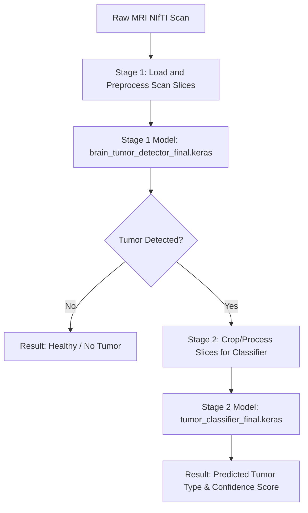

# 🧠 Brain Tumor Detection & Classification System - Code Explanation

This document provides a comprehensive explanation of the Python scripts (`train_model1.py` and `train_model2.py`) used in this project, explaining their purpose, how they train the models, and how prediction outputs are obtained.

---

## 📂 Project Overview

The project uses a two-stage deep learning pipeline to detect and classify brain tumors from MRI scans:

1. **Stage 1 (Detection)**: A custom Convolutional Neural Network (CNN) model analyzes 3D NIfTI scans to identify if a tumor is present.
2. **Stage 2 (Classification)**: A Transfer Learning model based on MobileNetV2 classifies the tumor into one of four types: **Glioma, Meningioma, Pituitary, or Healthy**.

---

## 🔬 Script 1: `train_model1.py` (Tumor Detection)

This script trains a binary classifier to detect whether a brain tumor exists in a given slice of a 3D NIfTI scan.

### 1. What it does

- Loads 3D MRI scans in **NIfTI format** (`.nii` files) from the BraTS2020 dataset.
- Normalizes and processes multiple MRI modalities (**FLAIR, T1ce, T2**) to capture different characteristics of the tissue.
- Extracts individual 2D slices from the 3D scan and pairs them with their ground-truth segmentation masks to label slices as containing a tumor (`1`) or being healthy (`0`).
- Trains a custom CNN to classify individual 2D stacked slices.

### 2. How the Model is Trained

#### Data Preprocessing & Input Preparation

- **Modality Stacking**: For each patient scan, the script reads three modalities: FLAIR, T1ce, and T2. These are normalized by dividing by their maximum intensity:
  $$\text{Normalized Modality} = \frac{\text{Modality}}{\max(\text{Modality})}$$
- **Slicing and Labeling**: Slices from index 40 to 120 are extracted (the middle slices where tumors are most visible).
- **Label Generation**: If the segmentation mask (`seg.nii`) for a slice contains values greater than 0, the slice is labeled as **Tumor (`1`)**; otherwise, it is labeled as **Healthy (`0`)**.
- **Resize and Stack**: The FLAIR, T1ce, and T2 slices are stacked along the channel axis to form a $128 \times 128 \times 3$ input tensor.

#### Model Architecture

The network is a custom Sequential CNN:

- **Input Layer**: Shape $128 \times 128 \times 3$.
- **Feature Extraction**: Three convolutional blocks containing a `Conv2D` layer followed by a `MaxPooling2D` layer:
  - Block 1: 32 filters of size $3 \times 3$, ReLU activation.
  - Block 2: 64 filters of size $3 \times 3$, ReLU activation.
  - Block 3: 128 filters of size $3 \times 3$, ReLU activation.
- **Classification Head**:
  - `GlobalAveragePooling2D` to reduce spatial dimensions and prevent overfitting.
  - `Dense` layer with 128 units and ReLU activation.
  - `Dropout` layer (rate = 0.5) to reduce overfitting.
  - `Dense` output layer with 1 unit and Sigmoid activation (outputs a probability between 0 and 1).

#### Training Parameters

- **Optimizer**: Adam
- **Loss Function**: Binary Crossentropy
- **Metrics**: Accuracy
- **Batch Size**: 64
- **Epochs**: 30 (with Early Stopping patience of 7 epochs on validation loss)
- **Model Checkpoints**: Saves the best weights to `brain_tumor_detector_best.keras`.

### 3. How the Output is Obtained

During inference, the model evaluates unseen 3D scans (e.g., from validation folders) that do not have segmentation masks:

- The script loads the NIfTI files and processes the FLAIR, T1ce, and T2 modalities.
- Samples slices (typically between indices 70 and 80) and resizes them to $128 \times 128 \times 3$.
- `model.predict()` evaluates the probability of each slice.
- Slices with a probability $> 0.5$ are outputted as **"Tumor Detected"**, while those $\le 0.5$ are classified as **"Healthy (No Tumor)"**.

---

## 🎨 Script 2: `train_model2.py` (Tumor Classification)

This script trains a multi-class image classification model to determine the type of tumor present in an MRI image.

### 1. What it does

- Loads 2D JPG brain MRI images from the Kaggle Brain Tumor Classification dataset.
- The dataset is divided into 4 classes:
  1. `glioma_tumor`
  2. `meningioma_tumor`
  3. `no_tumor`
  4. `pituitary_tumor`
- Trains an image classifier using **Transfer Learning** (MobileNetV2 backbone) to achieve high accuracy and fast convergence.

### 2. How the Model is Trained

#### Data Augmentation & Preprocessing

To prevent the model from overfitting, data augmentation is applied to the training dataset:

- **Rescaling & Normalization**: Utilizes the official MobileNetV2 `preprocess_input` function.
- **Augmentation**: Rotations (up to 15°), width/height shifts (10%), zoom (10%), and horizontal flips are randomly applied during training.
- **Target Size**: All images are resized to $224 \times 224 \times 3$.

#### Model Architecture

The network is based on **MobileNetV2** pretrained on ImageNet:

- **Base Model**: MobileNetV2 with top layers excluded (`include_top=False`), and weights frozen (`trainable = False`) to retain features learned from ImageNet.
- **GlobalAveragePooling2D**: Flattens the feature map from the base model.
- **Regularization Layer**: A Dense layer with 128 units, ReLU activation, and L2 regularization (`kernel_regularizer=regularizers.l2(0.01)`) to prevent overfitting.
- **Dropout**: Dropout rate of 0.5.
- **Output Layer**: Dense layer with 4 units and Softmax activation to compute probability distribution over the four tumor classes.

#### Training Parameters

- **Optimizer**: Adam with a customized learning rate of `0.0005`.
- **Loss Function**: Categorical Crossentropy.
- **Metrics**: Accuracy.
- **Batch Size**: 32.
- **Callbacks**:
  - `ModelCheckpoint` saves the best model to `tumor_classifier_best.keras`.
  - `EarlyStopping` (patience = 7, restores best weights).
  - `ReduceLROnPlateau` halves the learning rate if validation loss doesn't improve for 2 consecutive epochs.

### 3. How the Output is Obtained

- Images are preprocessed and fed into the model.
- `model.predict()` yields a list of 4 probability scores summing to 1.0.
- The class with the highest probability is chosen using `argmax`.
- For example, if the predictions are:
  - Glioma: `0.05`
  - Meningioma: `0.75`
  - No Tumor: `0.02`
  - Pituitary: `0.18`

  The output will be classified as **Meningioma Tumor** (75% confidence score).

---

## 🔗 How They Connect in the Jupyter Notebook

The main pipeline in `final_output.ipynb` links both models to form a comprehensive diagnostic system:



### Inference Code Flow Example:

```python
# Stage 1: Detection
detector = load_model('brain_tumor_detector_final.keras')
has_tumor_prob = detector.predict(processed_slice)

if has_tumor_prob > 0.5:
    print("Tumor Detected! Proceeding to classification...")

    # Stage 2: Classification
    classifier = load_model('tumor_classifier_final.keras')
    predictions = classifier.predict(processed_slice)
    predicted_class = np.argmax(predictions)

    classes = ['Glioma', 'Meningioma', 'Healthy', 'Pituitary']
    print(f"Tumor Type: {classes[predicted_class]} ({predictions[0][predicted_class]*100:.2f}%)")
else:
    print("Healthy Scan - No Tumor Detected.")
```
